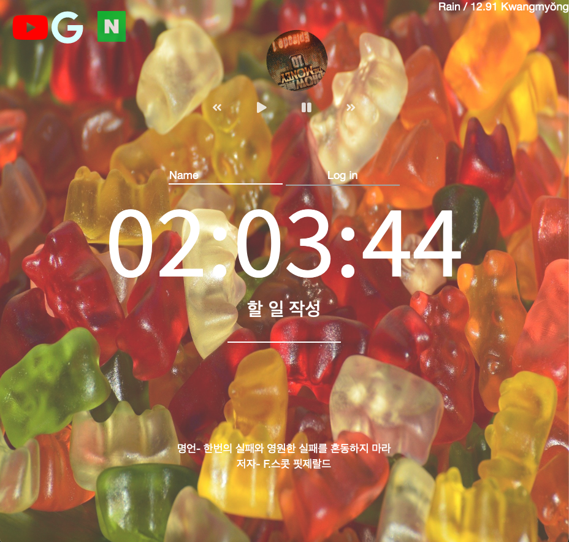

# VanillaJS momentum 클론 코딩

# 프로젝트 기간 
2022.01
 

프로젝트로 공부하면서 정리 한 내용, 옆의 링크를 통해서 볼 수 있습니다. [notion](https://chipped-sardine-ea7.notion.site/VanillaJSCloneCodeing-402854a76f1740b69445d41523f0503c)

# 프로젝트 설명 
- VaillaJS를 공부하려던 도중 nomadCoder에서 toDoList 클론 코딩이 괜찮은 강의라는 생각이 들어 클론코딩 하게 되었습니다. 
- JS (ES6)문법으로 작성이 되어 있습니다.
- Weather API를 사용하여 위치정보가 켜져 있으면 사용자가 살고 있는 지역의 날씨를 알 수 있게 만들었습니다. 

# 사용한 스택
</a> 
</a> 
</a> 

# UI구성

- 자주 찾는 사이트들을 상단에 위치하여 클릭하면 사이트로 이동되어지게 만들었다. 
- 오늘의 날씨와 지금 지역을 불러온다. 
- localStrage에 저장될 수 있게 만들었다. 
- toDoList를 작성할 수 있다. 
- 현재 시간이 출력된다. 

# 홈페이지 
옆의 링크를 클릭하면 웹사이트로 가집니다->[웹페이지 사이트](https://hanseu9839.github.io/momentum_clon_coding/)